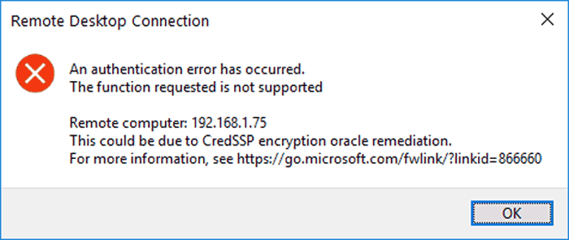
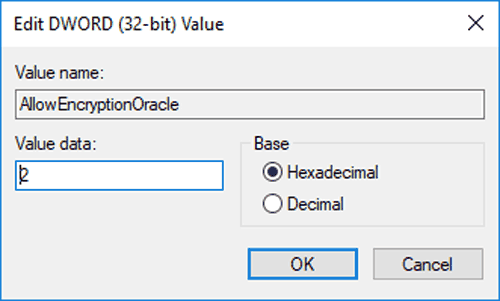

# RDP CREDSSP PROBLEM

## MANUAL FIX

This is a quick credssp registry fix for the following error when trying to connect to a machine using RDP (Remote Desktop):



This is because the server you are connecting to is not patched up to date, and the machine you are connecting from is. Modify the registry to allow your machine to connect to it:

1. Open Regedit.
2. Navigate to the following registry key, or create it if it does not exist:

   ``````
   HKEY_LOCAL_MACHINE\SOFTWARE\Microsoft\Windows\CurrentVersion\Policies\System\CredSSP\Parameters
   ``````
3. Create a new DWORD value called “**AllowEncryptionOracle** “
4. Set the new registry entry to have a value of 2:



5. Connect to the server that you were unable to connect to before.

## EASY FIX

1. Open notepad
2. Write down following code in notepad

   ```batch
   REG ADD "HKLM\SOFTWARE\Microsoft\Windows\CurrentVersion\Policies\System\CredSSP\Parameters" /v AllowEncryptionOracle /t REG_DWORD /d 2
   ```
3. Save this file as ```credssp.bat```
4. Run it as ```Administrator```

   ** Or you can just download it and run it **

   [CREDSSP.bat](assets/CREDSSP.bat)
